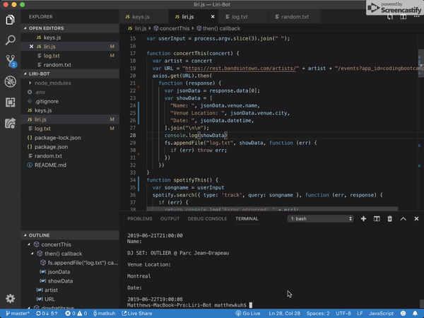
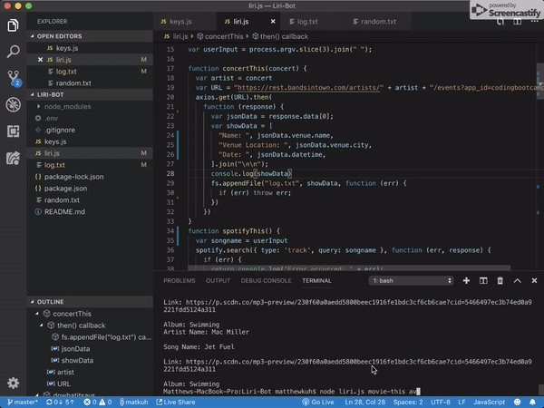

# Liri-Bot

### I created a liri-bot that will look up concert info (bandsintown), song info (spotify) and movie info (imbd).  There is no html or css and this was done all through javascript.  The user can put commands into the terminal and get relevant information back ie: node liri.js spotify-this-song jet fuel.

## Tech I Used

1. [JavaScript](https://www.w3schools.com/js/js_intro.asp)
2. [Node](https://nodejs.org/en/about/)

Author : [Matthew Kuh](https://github.com/matkuh)